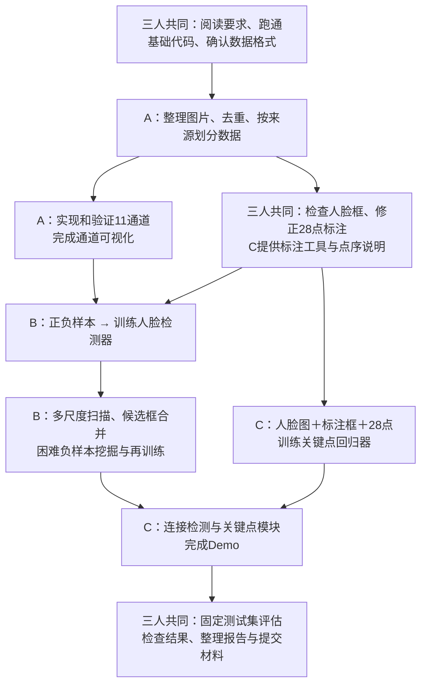

# 项目一：三人工作流程与 A / B / C 对接说明

这份文档供三位同学一起梳理项目使用。三人平等协作，A、B、C 只是模块名称，每个人都可以运行和理解完整流程，再深入完善自己负责的部分。

整体顺序是：**共同确定数据和接口 → A 整理数据与特征 → B、C 分别训练两个模块 → 连接系统 → 一起测试和整理报告。**

本文描述计划与分工，不表示所有功能已经完成。实际实现和验证状态见 [STATUS.md](STATUS.md)，代码运行方式见 [README](../README.md)，接口细节见 [INTERFACES.md](INTERFACES.md)。课程要求以老师原始 PDF 和详细说明为准。

## 1. 整体流程图

图中的箭头表示数据或接口依赖。已有基础实现可以先用于对接，各模块不必等队友全部完成后才开始。

## 2. 先统一最终要做出来什么——三人共同

最终输入一张动漫图片，程序输出：

- **人脸框和检测分数**：回答“脸在哪里”，主要由 B 实现。
- **28 个关键点**：回答“脸上的五官在哪里”，主要由 C 实现。
- **可视化图片和结构化 JSON**：方便演示、检查和后续处理。

A 为系统提供整理后的数据、11 通道特征和检测评价工具。三人先运行同一套基础代码，确认环境和调用方式，再分别深入。

合成样例用于检查程序能否连接起来。课程报告中的效果结论需要真实数据验证。

## 3. 把数据准备好——A 整理，三人一起检查

### 3.1 需要的三类数据

| 数据 | 用途 | 主要对接 |
|---|---|---|
| 动漫人脸图片及人脸框 | 检测器正样本 | A → B |
| 动漫背景、文字、衣服、建筑等非人脸区域 | 检测器负样本 | A → B |
| 人脸图片、人脸框、28 点坐标和可见性 | 关键点回归训练 | 三人检查和修正，C 提供工具 |

AnimeFace 主要解决人脸图片来源。背景负样本与 28 点标注需要另外准备。裁剪后的人脸图片也需要筛选，不能默认每张都适合作为正样本或具有精确人脸框。

A 负责数据清单、来源记录、去重和划分；C 提供点序说明、预标注导入与人工修正工具。人工检查、标注修正和测试集复核由三人分担。

### 3.2 先分组，再划分

先按原始图片或漫画页面、完全重复及近似重复关系分组，再按老师建议划分训练集 75%、验证集 10%、测试集 15%。原图后续产生的裁剪、缩放和增强版本沿用原图所属集合。

| 集合 | 作用 | 使用约定 |
|---|---|---|
| 训练集 | 学习模型参数 | 数据增强和困难负样本挖掘使用训练数据 |
| 验证集 | 调参数、选择阈值、比较方案 | 不混入训练样本 |
| 测试集 | 方案确定后检查最终效果 | 不用于训练、调阈值或反复选择方案 |

保存固定清单和随机种子，让三人使用同一套划分。仅去掉完全重复图还不足以排除近似重复或同源图片泄漏。

## 4. A 完善特征，B、C 分别推进

| 成员 | 核心工作 | 给队友的成果 |
|---|---|---|
| A | 数据准备、11 通道验证、通道观察、检测评价 | 数据清单、通道函数、可视化结果、评价函数 |
| B | Depth-2 AdaBoost Cascade 训练、多尺度搜索、候选框合并 | 输入图片，输出原图坐标下的人脸框和分数 |
| C | 点序与可见性、多级形状回归、端到端演示 | 输入图片和人脸框，输出原图坐标下的 28 点 |

### 4.1 A 的具体流程

1. 检查图片可读性、来源和重复情况，整理正负样本。
2. 验证 11 通道的公式、取整、边界和溢出处理。
3. 保持 `compute_11_channels(gray)` 与公共接口一致。
4. 完成老师要求的通道可视化：2 张真实正面人脸、2 张近正面动漫人脸、1 张头发遮挡动漫人脸、1 张复杂漫画背景。
5. 解释哪些通道突出眼睛或轮廓，哪些容易受头发、文字框和背景干扰。
6. 完善 IoU、Precision、Recall、F1 的匹配与汇总，供 B 评价检测结果。

人脸框在同一张图中应进行一对一匹配；同一张脸被重复检测不能全部计为正确。正式全图检测评价需要该图完整的人脸真值框集合。

### 4.2 B 的具体流程

1. 调用 A 的通道函数，读取固定训练和验证数据。
2. 训练 Depth-2 弱树，通过 AdaBoost 组合成阶段，再构建至少三级 Cascade。
3. 在多尺度图像上滑窗，使用 NMS 或聚类合并重复候选框。
4. 使用验证集检查阈值、召回与误报，记录各阶段通过情况和耗时。
5. 在训练场景中寻找困难负样本，加入训练集后重新训练。
6. 比较步长、尺度等设置，使用 A 的评价函数记录效果。

对应循环为：**训练 → 扫描训练场景 → 收集误检 → 加入负样本 → 再训练 → 用验证集比较。** 按老师要求展示至少 6 个困难负样本，并解释误检原因。

### 4.3 C 的具体流程

1. 固定 28 点编号、坐标格式和可见性规则，提供编号示意图。
2. 协助生成预标注，并由三人分担人工修正和测试集检查。
3. 根据标注框构建平均形状，采样局部像素差，通过多级回归预测形状残差。
4. 先用正确的人脸标注框训练和评价回归器。
5. 再接入 B 的预测框，检查端到端关键点效果。
6. 用 NME 评价可见点，明确双眼中心距离及必要时框对角线归一化的使用规则。

**C 可以先用人工标注框训练，不必等 B 的检测器完成。** B 也可以先调用仓库现有的通道实现，与 A 并行完善。

## 5. 连接系统并定位问题

端到端处理为：

**输入图片 → B 检测人脸框 → C 根据每个人脸框预测 28 点 → 输出图片与 JSON。**

C 维护演示入口，涉及 A、B 模块的问题由相应成员一起解决。公共格式以 INTERFACES 为准，接口改变时同步修改调用方、文档和相关测试。

| 现象 | 优先检查 |
|---|---|
| 漏检人脸或把背景当作脸 | B 的检测结果、A 的样本与特征 |
| 用正确框也预测不好关键点 | C 的标注、点序和回归器 |
| 用正确框效果好，换检测框后变差 | B 的框定位与 C 的框归一化、训练适应性 |
| 点整体偏移、缩放后位置不对 | 原图坐标还原与接口约定 |
| 三人运行同一输入却结果不同 | 数据版本、划分、模型、参数、随机种子与环境 |

每人都运行完整流程，交换可复现输入和输出，共同检查无脸、多脸、遮挡等情况。

## 6. 最终测试与提交——三人共同

方案确定后，在固定测试集上运行并记录结果。

| 检查内容 | 主要负责 |
|---|---|
| 数据泄漏、通道计算、检测匹配规则 | A |
| 漏检、误检、各级通过情况、检测耗时 | B |
| 关键点误差、坐标还原、结果图与 JSON | C |
| 完整复现、报告整合、课程提交检查 | 三人共同 |

最终材料包括：源代码与运行说明、28 点图片和标注数据、模型与配置、特征通道图与检测效果 Demo、项目报告。各自撰写对应部分，再共同检查完整性和结论。

公开 GitHub 仓库主要保存代码、说明与复现方法。真实数据和大型模型按来源许可及团队约定另行共享；不将密钥或未经允许再分发的数据上传。课程最终交付仍需包含老师要求的材料。

## 7. 现在一起讨论什么

可以围绕下面四项确定第一轮试验：

- [ ] 先选哪一小批人脸图，筛选标准是什么？
- [ ] 真实动漫背景负样本从哪里补充？
- [ ] 28 点采用哪个固定编号，三人怎样分担人工修正？
- [ ] 数据版本、清单、模型存放位置如何保持一致？

第一次共同里程碑是：**同一批真实样本能被 A 正确读取和处理，B 完成一次检测训练，C 完成一次关键点训练，最终 Demo 可以调用两者，并如实记录效果。**

先完成小批真实数据的完整流程，检查各环节，再扩大数据量和改进效果。数据量和效果指标以实际实验为准，不把这个里程碑当作课程全部要求已经完成。

## 8. 日常协作

开始任务前检查本地修改和远程更新，每人使用独立分支，通过 Pull Request 合并。涉及共享文件或公共接口时说明影响，保护已有工作。

README 随实际框架和命令更新，STATUS 记录实现、合成验证、真实实验分别达到哪一步。具体文件分工与 Codex 工作语境见 [CODEX_COLLABORATION.md](CODEX_COLLABORATION.md)。
